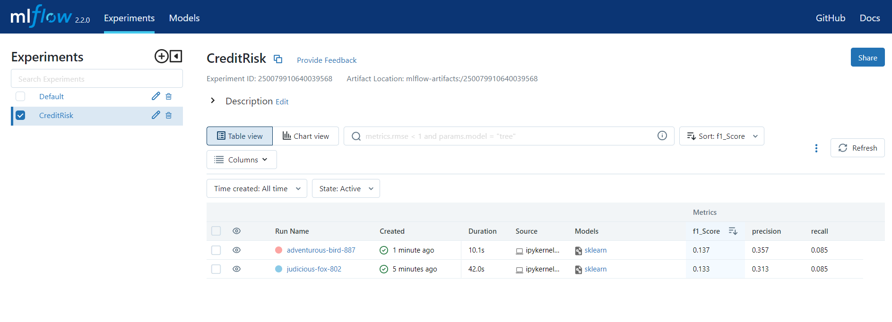
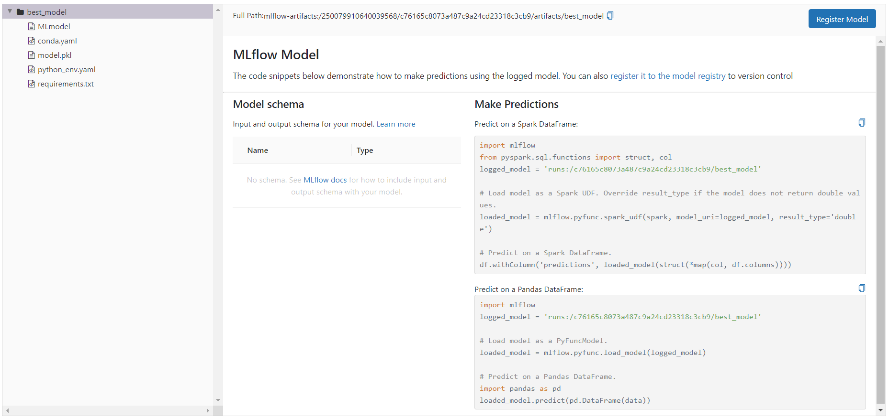
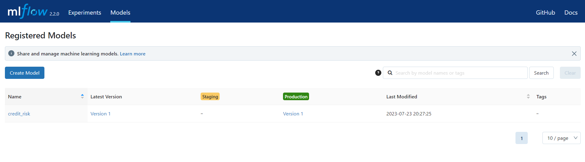

# **MLflow**

https://www.kaggle.com/datasets/uciml/german-credit/discussion

## **Ambiente Virtual**

En el archivo `environment.yaml` agregar las librerias necesarias para desarrollar el proyecto.

Crear ambiente virtual:

    conda env create -f environment.yaml

    conda activate datapath_mlflow

    ipython kernel install --user --name=datapath_mlflow
    
Salir de entorno:
    
    conda deactivate

Remover entorno:

    conda env remove --name datapath_py01 --all

## **Datos**

Descargar datos:

    mkdir data && cd data
    kaggle datasets download -d kabure/german-credit-data-with-risk
    unzip german-credit-data-with-risk.zip

## **EDA**

Realizar análisis exploratorio de variables, limpieza de datos, feature engineering, feature selection.

    mlf_notebook.ipynb

## **Entrenamiento del modelo**

Realizar el entrenamiento del modelo ML: train, test, validación.

    my_notebook.ipynb

## **MLflow UI**

Visualizar resultados en interfaz de MLflow:

```ssh
mlflow ui
```





## **Deploy**

Verificar que el mejor modelo se haya asignado a producción:



## **Github**

Generar los commits para evidenciar los avances del proyecto:

```ssh
git init
git pull

git branch dev
git checkout dev

git add .
git commit -m "registro del modelo y probar predictions"
git push origin dev
```

Merge con rama main:

```ssh

git checkout main
git merge dev -m "merge dev sin conflictos"
```

Link del repo:

    https://github.com/alangrosso/datapath-mle/tree/main/04-mlflow