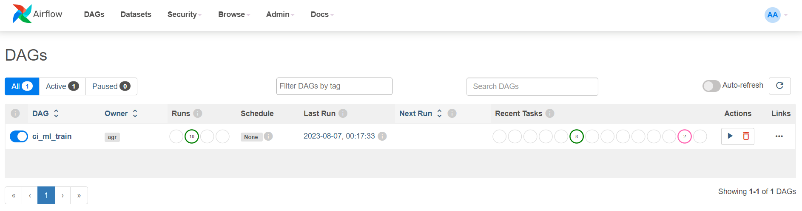
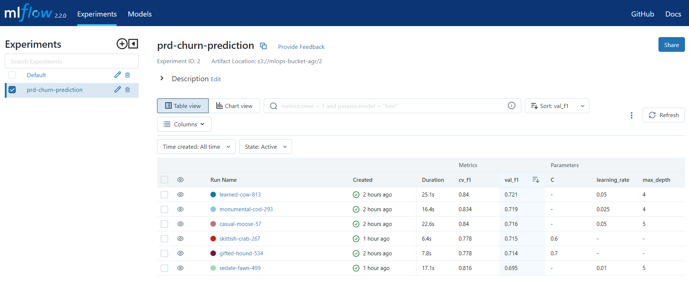
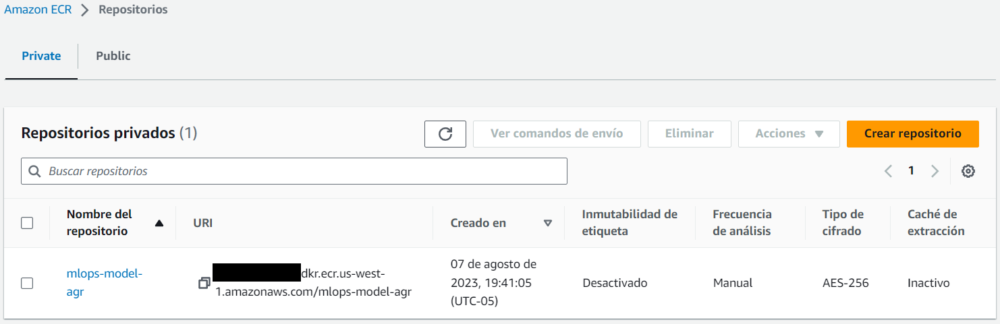
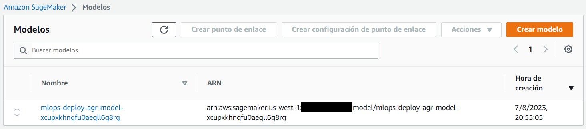
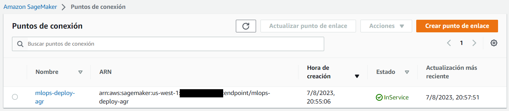
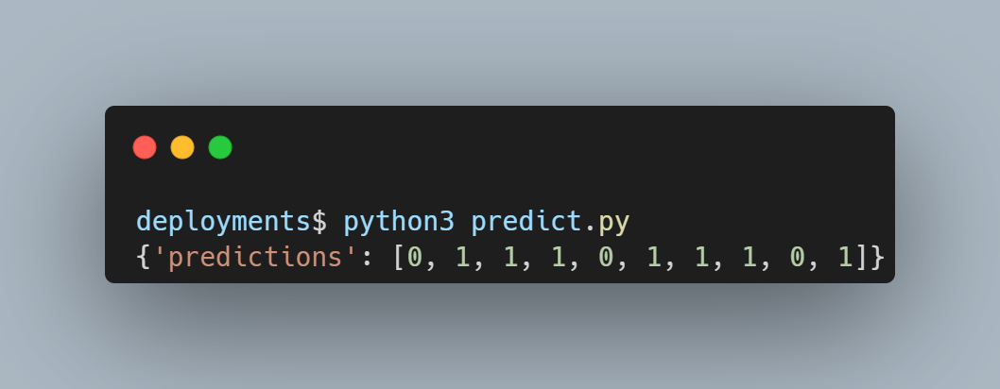

# **MLOps**

Machine Learning pipeline:

`1. Read Data`➙`2. Split train-test`➙`3. Preprocess Data`➙`4. Train Model`➙<br>
&emsp; &emsp; &emsp; ➙ `5.1 Register Model`<br>
&emsp; &emsp; &emsp; ➙ `5.2 Update Registered Model`<br>

Telco Customer Churn dataset: <a href="https://www.kaggle.com/datasets/blastchar/telco-customer-churn" target="_blank">Kaggle</a>.

## **Tech Stack**
<a href="https://mlflow.org/" target="_blank"></a>: For experiment tracking and model registration<br>
<a href="https://www.postgresql.org/" target="_blank"></a>: Store the MLflow tracking<br>
<a href="https://aws.amazon.com/s3/" target="_blank"></a>: Store the artifacts and registered MLflow models<br>
<a href="https://aws.amazon.com/ecr/" target="_blank"></a>: Container registry<br>
<a href="https://aws.amazon.com/sagemaker/" target="_blank"></a>: Prepare, build, train, and deploy ML models<br>
<a href="https://airflow.apache.org/" target="_blank"></a>: Orchestrate the MLOps pipeline<br>
<a href="https://scikit-learn.org/stable/index.html" target="_blank"></a>: Machine Learning<br>
<a href="https://jupyter.org/" target="_blank"></a>: R&D<br>
<a href="https://www.python.org/" target="_blank"></a>
<a href="https://www.anaconda.com/" target="_blank"></a>
<a href="https://code.visualstudio.com/" target="_blank"></a>
<a href="https://www.docker.com/" target="_blank"></a>
<a href="https://git-scm.com/" target="_blank"></a>

## **Ambiente Virtual**

Crear y activar ambiente virtual:

```commandline
cd 05-mlops-aws-architecture

python3.10 -m venv mlops-aws-env
source py_env/bin/activate
pip install --upgrade pip
```

Instalar las librerias necesarias para el desarrollo del proyecto, que se encuentran detalladas en el archivo `requirements.txt`:

```commandline
pip install -r requirements.txt

# Kernel
ipython kernel install --user --name=mlops-aws-env
```

## **Configuración**

Limpiar logs y crear carpeta para poder ejecutar Airflow:

```commandline
rm -r -f ./airflow/logs
mkdir -p ./airflow/logs ./airflow/plugins
```

Renombrar el archivo `.env_sample` a `.env`.

```commandline
cp .env_sample .env
. .env
```

Actualizar las siguientes variables:
   - AWS_ACCESS_KEY_ID
   - AWS_SECRET_ACCESS_KEY
   - AWS_REGION
   - AWS_BUCKET_NAME

Obtener datos de configuración en AWS:

```commandline
aws configure
```

Generar las políticas y roles para el usuario en AWS y poder utilizar los siguientes servicios:
   - S3: AmazonS3FullAccess.
   - ECR: AmazonEC2ContainerRegistryFullAccess.
   - Sagemaker: AmazonSageMakerFullAccess.

Crear bucket en S3 (de acuerdo a nombre considerado en `.env`).

Algunos comandos de AWS Cli para revisar la configuración y servicios activos:

```commandline
# Usuarios
aws iam list-users

# Políticas
aws iam list-attached-user-policies --user-name NOMBRE_USUARIO

# Roles
aws iam list-roles

# Buckets 
aws s3 ls

# Endpoints
aws sagemaker list-endpoints

# Imágenes
aws sagemaker list-images

# Modelos
aws sagemaker list-models

# Artefactos
aws sagemaker list-artifacts
```

## **Contenedores**

Ejecutar los Dockerfile que contienen la configuración de cada proceso del pipeline:

```commandline
cd dockerfiles

cd airflow
docker build -t mlops-airflow .
cd ..

cd jupyter
docker build -t mlops-airflow .
cd ..

cd mlflow
docker build -t mlops-airflow .
cd ../..

docker-compose up --build -d
```

Visualizar recursos creados:

```commandline
# Contenedores:
docker ps
docker ps -a

# Imágenes:
docker images
docker images --filter "reference=mlops-airflow"
```

### Urls

- <a href="http://localhost:8080" target="_blank">http://localhost:8080<a/> for `Airflow`. Use credentials: airflow/airflow
- <a href="http://localhost:5000" target="_blank">http://localhost:5000<a/> for `MLflow`.
- <a href="http://localhost:8893" target="_blank">http://localhost:8893<a/> for `Jupyter Lab`. Use token: mlops

### Cleanup

Detener los contenedores a través de `docker-compose`:

```commandline
docker-compose stop
```

O detener los contenedores a través de `docker`:

```commandline
docker stop $(docker ps -q)

# Eliminar contenedores
docker rm $(docker ps -aq)
```

Finalmente, eliminar los `volume`:

```commandline
docker volume rm $(docker volume ls -q)
```

## **Entrenamiento del modelo**

Ejecutar el DAG de Airflow que realiza el proceso de entrenamiento de los modelos ML.



## **MLflow UI**

Resultados en interfaz de MLflow.



## **Deployment**

### Local

- En MLflow y AWS identificar el artefacto en producción y generar las variables necesarias para el despliegue del modelo.
   - AWS_BUCKET_NAME=""
   - EXP_ID=""
   - RUN_ID=""
   - MODEL_NAME=""
   - PORT=1234

```commandline
mlflow models serve --model-uri s3://$AWS_BUCKET_NAME/$EXP_ID/$RUN_ID/artifacts/$MODEL_NAME -p $PORT --no-conda
```

Abrir una nueva terminal y obtener las predicciones:

```commandline
cd deployments
python3 predict_local.py
```

### Cloud

- En MLflow y AWS identificar el artefacto en producción y generar las variables para el despliegue del modelo.

```commandline
export MLFLOW_TRACKING_URI=http://localhost:5000
EXP_ID=""
RUN_ID=""
MODEL_NAME=""
IMAGE_NAME=
AWS_BUCKET_NAME=""
```

- Dockerizar el artefacto (en local) apuntando a un artefacto en cloud:

```commandline
mlflow models build-docker --name $IMAGE_NAME --model-uri s3://$AWS_BUCKET_NAME/$EXP_ID/$RUN_ID/artifacts/$MODEL_NAME --env-manager conda

# Verificar la imagen creada:
docker images
```

- Cargar la imagen de Docker en AWS.

```commandline
mlflow sagemaker build-and-push-container --no-build -c $IMAGE_NAME

# Verificar los servicios creados:
aws ecr list-images --repository-name NOMBRE_IMAGEN
```



- Realizar el despliegue en SageMaker:

```commandline
cd deployments
python3 deploy.py
```

Verificar los servicios creados:

```commandline
# Modelo
aws sagemaker list-models

# Endpoint
aws sagemaker list-endpoints
```





- Obtener las predicciones:

```commandline
cd deployments
python3 predict.py
```



## **Github**

Generar los commits del avance del proyecto:

```commandline
git init
git pull

git branch dev
git checkout dev

git add .
git commit -m "agregando proyecto 05"
git push origin dev
```

Merge con rama main:

```commandline
git checkout main
git merge dev -m "merge dev sin conflictos"
```

Link del <a href="https://github.com/alangrosso/datapath-mle/tree/main/05-mlops-aws-architecture" target="_blank">repo<a/>.
